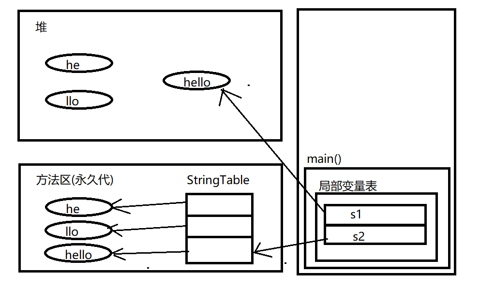

# 从字节码层面理解JVM内存模型

## Java 技术体系

从传统意义上看，JCP官方定义的JAVA技术体系包括了以下几个组成部分：

- Java 程序设计语言
- 各种硬件平台上的 Java 虚拟机实现
- Class 文件格式
- Java 类库 API
- 来自商业机构和开源社区的第三方 Java 类库

 

### 功能划分

如果将它们根据 Java 各组成部分的功能来进行划分，大致可分为 JDK，JRE，JVM

* **JDK**（Java Development Kit，Java 开发工具包）

  JDK 是用于支持 Java 程序开发的最小环境，可以把 `Java 程序设计语言`、`Java 虚拟机`、`Java 类库`这三部分统称为 JDK ，通常也用 JDK 代指整个 Java 体系

* **JRE**（Java Runtime Environment，Java 运行时环境）

  JRE 是支持 Java程序运行的标准环境，可以把 `Java 类库API` 中的` Java SE API子集`和 Java 虚拟机这两部分统称为 JRE

* **JVM**（Java VirtualMachine，Java 虚拟机）

  本系列文章的主题，在此不做过多展开。

### 技术划分

如果将它们按照技术所服务的领域来划分，或者按照技术关注的重点业务来划分的话，大致可分为 Java Card、Java ME、Java SE、Java EE

* **Java Card**

  支持 Java 小程序（Applets）运行在小内存设备（如智能卡）上的平台

* **Java ME**（Micro Edition）

  支持 Java 程序运行在移动终端（手机、PDA）上的平台，对 Java API 有所精简，并加入了移动终端的针对性支持，在 JDK6 以前也被称为 J2ME

  > 主要使用 Java 语言开发程序的 Android 并不属于 Java ME

* **Java SE**（Standard Edition）

  支持面向桌面级应用（如 Windows 下的应用程序）的 Java 平台，提供完整的 Java 核心 API，在 JDK6 以前也被称为 J2SE

* **Java EE**（Enterprise Edition）

  支持使用多层架构的企业应用（如 ERP、MIS、CRM 应用）的 Java 平台，除了提供 Java SE API 外，还对其做了大量有针对性的扩充，并提供了相关的部署支持。在 JDK6 以前也被称为 J2EE

  > Java EE 在 JDK10 以后被 Oracle 放弃，捐献给了 Eclipse 基金会管理，此后被称为 Jakarta EE

## Java 内存模型


这张图相信大家都不陌生，因此本文将不再就图上内容做详细介绍（书上都有，再介绍也不会比书上详细多少）。

```java
public class Test {

    public static final int CONSTANT_TEST = 1;
    public static Test staticTest = new Test();
    public Test test;

    public int sum(int a, int b) {
        return a + b;
    }

    public static void main(String[] args) {
        int a = 1;
        int b = 2;
        Test test = new Test();
        test.sum(a, b);
    }

}

```

我们首先准备这样一个 Java 类，并反编译得到该类的字节码文件。接下来我将就字节码内容结合上图描述的内存模型介绍它们之间的关联关系。

### 常量池

打开反编译得到的字节码文件，最上面显示的一些类信息、魔数、主版本号、次版本号啥的，这些我们先按下不表。这一块内容后面有机会我们再详细讲解。

我们首先看到 Constant pool，这一块描述的就是常量池：


常量池是方法区的一部分，我们可以将常量池看作 class 类的一个资源仓库，里面主要存放了 Java 类的`字面量`以及`符号引用`，这些资源在编译期就会生成，在**类加载**后会被存放在方法区的**运行时常量池**中。在后续的方法的执行，类的描述信息，都是通过索引去常量池中定位所需的资源。

### 成员变量

再往下就是我们定义的三个成员变量，其中常量和静态变量是存放在方法区的常量池中的，这个我们上面也说过，这个地方唯一需要注意的是，实例变量是在堆中分配内存的，这一块没什么好说的我们继续往下看


### 方法信息表

再往下就来到了本章的重点，方法信息表，首先我们先整体看一下方法信息表的结构以及内容


这么大一长串的东西第一眼看过去的第一感觉是不是感觉跟 Java 代码很相似？其实 Java 代码最终的执行都是根据这上面的内容逐行执行的。接下来我们逐行分析。

首先第一个方法： public Test(); 这是类默认生成的无参构造方法，flags 表示它的访问修饰符权限，默认也是 public 的。

再往下是方法的 Code 属性，方法体编译后产生的字节码都放在这里面。其中 max_stark 表示的是方法的`最大操作数栈深度`，这里为 1 表示有一个值被压入了操作数栈，max_locals 表示的是`局部变量表变量的个数`，这里也是 1 说明局部变量表中也有一个值，args_size 该方法的`形参个数`。如果是实例方法，第一个形参是 this 引用。 

接下来就是该方法内真正执行的操作（感觉再讲下去这篇文章就得改名叫字节码解析了），首先执行的第一个指令就是 aload_0 ，通过查 Java字节码指令集我们可以得知，该指令就是将当前调用方法栈帧中局部变量表索引位置为0的局部变量推送到操作数栈的栈顶，如果是实例方法，局部变量表中索引位置为0的区域存放的就是 this 引用。 


后面的两个指令一个是调用父类（也就是 Object 类）的初始化方法，一个是 return 也就是构造方法出栈，这个就不详细讲了。此外还有一个行号表  LineNumberTable 这玩意用来记录 Java 源代码行号与字节码行号（字节码偏移量）的对应关系，报错的时候能显示异常发生在第几行第几个字符，以及打断点调试程序，依靠的就是这玩意。

在前面分析完构造函数执行的指令后，再看其他函数其实大致都是一样的。下面我们如法炮制，分析 sum() 和 main() 函数都做了哪些事情。

从它们调用关系出发，我们首先来分析 main() 方法：

iconst_1：将 int 类型常量 1 压入操作数栈，这里需要提一嘴，JVM 中的常量都存放在方法区的常量池中，将一个常量加载到操作数栈的指令有很多，在不同的取值范围下都有不同的指令用于操作，各位感兴趣可以自行了解一下

istore_1：将操作数栈中 int 类型值存入局部变量 1（非静态函数局部变量表 0 为this，只读）


在所有变量都赋值完毕后，接下来通过 new 指令开始创建对象，并将创建的对象地址压入操作数栈顶，这里的 new 指令指向了上面常量池中的 #2 位置，大家可以自行到常量池中查找一下，对应的就是 Test 这个类。创建对象的时候 JVM 会进行一系列的复杂操作，比如最为大家熟知的五个步骤：类加载检查、分配内存、初始化、设置对象头、执行 \<init> 方法，这个我们放在后面的章节中再详细介绍。在本章我们只做简要描述：

在通过 new 指令创建对象时，JVM 会首先通过类加载检查判断该类有没有被 JVM 加载（其实就是在方法区定位一个类的类元信息），如果没有的话就会先进行类加载，在类加载阶段会为指定类在元数据区生成一个 Klass 模型用于表示该 Java 类，主要包括了类的常量池、字段、方法等信息 （对于普通的 Java 类 JVM 创建的是 InstanceKlass，数组创建的是 ArrayKlass），在真正创建对象的时候，JVM 会在堆区创建一个 OopDesc 实例来表示这个对象，该对象中包含了类的对象头和元数据信息，并在对象元数据区通过一个 klassPoint 指向方法区的类元信息，也就是该类的 Klass 模型，同时在堆区还会生成一个该类的 MirrorKlass 用于存储 Class 对象（也就是我们通过反射可以获取到的），同时在 Klass 中会通过一个指针指向堆区的 MirrorKlass 对象。这一段有点绕，我们画图解释：


执行完上述步骤后，对象就算真正创建完了，并且在操作数栈中也保存了一个该类对象的引用。

接下来执行的是 dup 指令，该指令复制操作数栈顶值，并将其压入操作数栈，此时操作数栈中就存在了两个 test 对象实例，在下面的 invokespecial 指令执行的时候，又会将栈顶的 test 实例弹栈，并调用该对象的 init() 初始化对象。 初始化完成后通过 astore_3 指令将该对象的引用保存到局部变量表中，之后 aload_3 指令又会从局部变量表中将该对象引用压入操作数栈（iload_1，iload_2 同理），之后就是通过 invokevirtual 指令调用 sum() 方法，执行完后将 sum() 方法栈帧弹出虚拟机栈，之后返回。

最后再说下 sum() 方法的执行，这个就很简单了，就是一个求和操作。跟构造函数一样，在执行到 iload_1，iload_2 指令时，就是将局部变量表索引位置 1，2 地址的局部变量加载到操作数栈，接下来通过 iadd 指令进行加法运算（这两个操作数最终会被加载到CPU寄存器，由CPU进行运算处理），之后就是 ireturn 将计算之后的结果返回到main()，至此整个字节码文件我们就分析得差不多了。

### 扩展：常量池详解

前面我们提到常量池可以看作 class 类的一个资源仓库，里面主要存放了 Java 类的`字面量`以及`符号引用`以及提到了运行时常量池的概念，那相信有些同学可能对这些概念还有些模糊，因此在文章的结尾我再多提一嘴，这块内容也是面试中经常被问到的。

#### 字面量和符号引用

首先解释一下字面量和符号引用的概念：

##### 字面量

类似于 Java 中的常量，像字母、数字等构成的字符串或者数值常量、被声明为 final 的常量值等都可以被称为字面量。例如：

``` java
int a = 1;
String s = "1";
```

##### 符号引用

符号引用是属于编译原理方面的概念，包含了下面三类常量：

* 类和接口的全限定名（Fully Qualified Name）
* 字段的名称和描述符（Descriptor）
* 方法的名称和描述符

这些符号引用在编译期保存的只是静态信息，也就是说，在 Class 文件中不会保存各个方法和字段的最终内存布局信息，因此这些字段和方法的符号引用不经过转换的话是无法直接被虚拟机使用的。当虚拟机运行时，需要从常量池获得对应的符号引用，再在类创建时或运行时解析并翻译到具体的内存地址之中。只有到运行时被加载到内存后，这些符号才有对应的内存地址信息，这些常量池一旦被装入内存就变成**运行时常量池**，对应的符号引用在程序加载或运行时会被转变为被加载到内存区域的代码的直接引用。这个过程被为称为**动态链接**，符号引用转换成直接引用其实主要也是通过对象头里的类型指针去转换直接引用。

#### 字符串常量池

总所周知，字符串 String 是引用类型，在 JDK8 及以前 String 底层采用的是 char[]存储，而到了 JDK9 及以后开始改用 byte[] 加上编码标记节约空间。同时字符串做为最基础也是最常用的数据类型，如果每次使用都需要单独为字符串分配空间，显然是很不合理的。因此 JVM 为了提高性能和减少内存开销，在实例化字符串常量时进行了一些优化：

为字符串单独开辟一块空间，用于缓存字符串，这块空间也被称作字符串常量池。在创建字符串时，如果池中已经包含一个等于此 String 对象的字符串，则返回代表池中这个字符串的 String 对象。否则，将此 String 对象包含的字符串添加到常量池中，并且返回此 String 对象的引用。字符串常量池底层是一个固定大小的HashTable，其本质上保存的是字符串对象的引用。

此外关于字符串常量池的具体位置，在 JDK1.6、JDK1.7、JDK1.8及以后各有不同

* JDK1.6 及以前

  JDK1.6 及以前在 HotSport 虚拟机上还有永久代概念，运行时常量池被放在永久代，字符串常量池被放在运行时常量池中

* JDK1.7

  在 JDK1.7 开始逐步放弃永久代，并逐步改为采用本地内存来实现方法区。此时字符串常量池从永久代被分离出来放到了堆中

* JDK1.8 及之后

  在 JDK1.8 及以后完全废除了永久代概念，改为采用本地内存实现的元空间（Meta-space）来代替永久代。将原本存在永久代的运行时常量池、类型信息放到了元空间中，字符串常量池则依然在堆中

下面贴一段书中的代码，通过在不同 JDK 版本下运行以下代码即可得到验证：

``` java
/**
* VM Args：-XX:PermSize=10M -XX:MaxPermSize=10M
* @author zzm
*/
public class RuntimeConstantPoolOOM {
  public static void main(String[] args) {
    // 使用List保持着常量池引用，避免Full GC回收常量池行为
    List<String> list = new ArrayList<String>();
    // 10MB的PermSize在integer范围内足够产生OOM了
    int i = 0;
    while (true) {
    	list.add(String.valueOf(i++).intern());
    }
  }
}
```

在了解了上面的概念后，我们再来看一道比较常见的面试题：

下面的代码创建了多少个 String 对象？

``` java
String s1 = new String("he") + new String("llo");
String s2 = s1.intern();
System.out.println(s1 == s2);
```

答案是上面这段代码在  JDK 1.6 下输出是 false，创建了 6 个对象，而在 JDK 1.7 及以上的版本输出则是 true，创建了 5 个对象（不考虑 GC 情况）。之所以会产生这样的变化，主要还是字符串常量池从永久代脱离移入堆区的原因，从而导致 intern() 方法也相应发生了变化，下面我们通过两张图分别说明：

##### JDK1.6：

在 JDK1.6 时，由于有永久代的概念存在，当调用 intern() 时首先会从字符串常量池中取对应的字符串，如果该字符串存在字符串常量池中，就直接返回该字符串在字符串常量池中的引用；如果该字符串不在字符串常量池中，虚拟机首先会在永久代上重新创建一个该字符串的实例，将 StringTable 上的一个表项指向永久代上新创建的实例：



##### JDK1.7：

在 JDK1.7 之后，由于字符串常量池被移到了堆中，intern() 也相应的做出了一些改变，使得我们可以更方便地利用堆中的对象，此时如果字符串在字符串常量池中不存在，虚拟机就会首先在堆中创建一个该字符串的实例，而后将 StringTable 上的一个表项直接指向堆中的该字符串对象实例：


#### 八大基本类型的包装类和对象池

Java 中基本类型的包装类的大部分都实现了常量池技术(严格来说应该叫**对象池**，在堆上)，这些类是Byte，Short，Integer，Long，Character，Boolean另外两种浮点数类型的包装类Float、Double则没有实现。

此外只有在当上述 5 种类型的包装类的取值范围在 -128 ~127 之间才会使用常量池，其他超出这个范围的对象都会在堆中重新开辟内存。 关于这点我们可以通过看 Integer.valueOf() 的源码得到验证（其他类型同理）：


